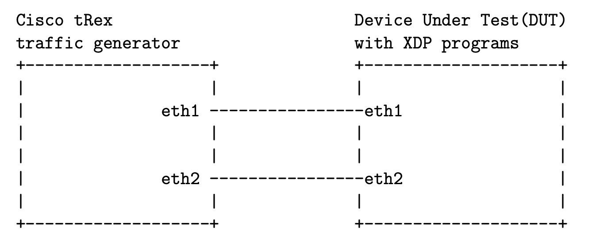

# eXpress-Data-Path
Fast Programmable Packet Processing in the Operating System Kernel

Reproducing the experiments of the paper 
*T. Høiland-Jørgensen, J. D. Brouer, D. Borkmann, J. Fastabend, T. Herbert, D. Ahern, et al., "The eXpress Data Path: Fast Programmable Packet Processing in the Operating System Kernel", ACM CoNEXT, 2018.*

## Experiment setup

The experiment setup follows RFC 2544 for Network benchmarking.

## Directory structure

**exp-setup/Vagrantfile** - RFC 2544 setup in local using Vagrant.  
**benchmarks** - Local benchmarks.  
**experiment-data** - Local experiment data.  
**exp-setup/aws** - RFC 2544 setup in aws cloud using Terraform.  
**exp-setup/aws/bench** - Cloud Benchmarks.  
**exp-setup/aws/exp-data** - Cloud experiment data.  
**report/xdp_report.pdf** - Detail summary of experiment results

